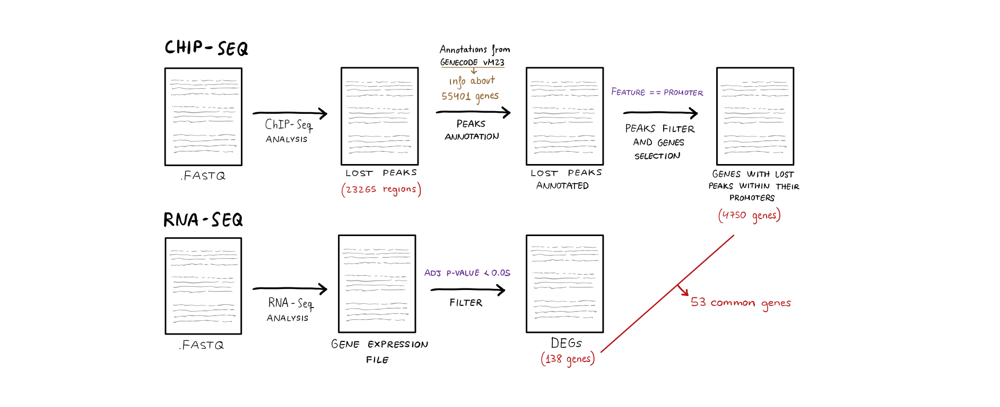
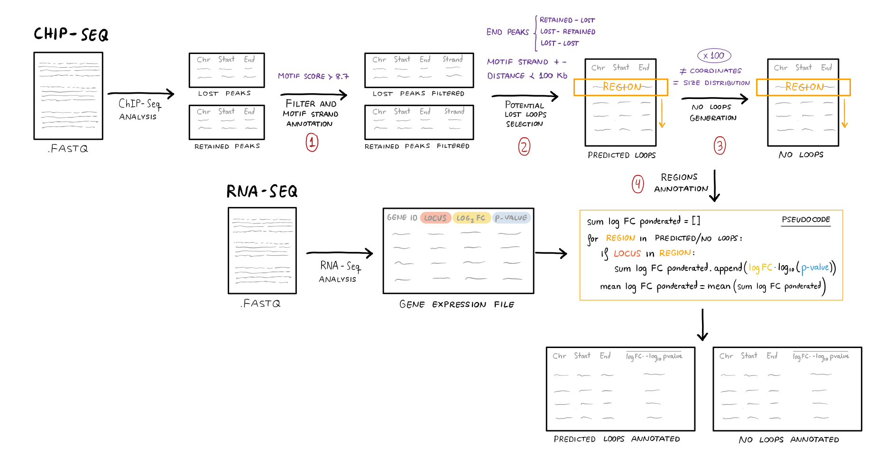

# TFM

This repository contains the code used to perform the analysis described in the master's thesis entitled "Transcriptional and structural outcomes of genome-wide CTCF depletion in B cells". It includes 5 directories that correspond to subsections of the methods section of the TFM memory. To execute the scripts included in each of these directories, there must be a parent directory "data" with the files used as input and a parent directory "results" to save the new files generated. Each of the scripts includes a description of its function, the files it needs to run, the files it generates, the programs required to run it, and any considerations that need to be taken into account. The following is an overview of the directories and their scripts: 

## ChIP-Seq analysis

This directory contains the scripts used to do the binding sites study explained in the section 4.2 of the master thesis. The Data directoy must contain fastq files from ChIP-Seq experiment, mm10 genome indexed, 
The 

Scripts in this directory:

**Basic_ChIPSeq_analysis.sh** processes the reads files from ChIP-Seq experiment and obtains the peak files. It does the quality assesment with fastqc, the read mapping with bowtie2, uses samtools to convert bam to sam, sort and filters the reads with sambamba and makes the peak-calling with macs2. 

**CTCF_chipQC.R** generates a quality report about the peaks with ChIPQC.

**DiffBind_lost_vs_retained.R** identifies differential binding sites and generates bed files with "lost" peaks (those only present in the control samples) and "retained" peaks (those present in both control and CTCF-deficient samples). 

More details about the scripts can be found in the description they contain.

